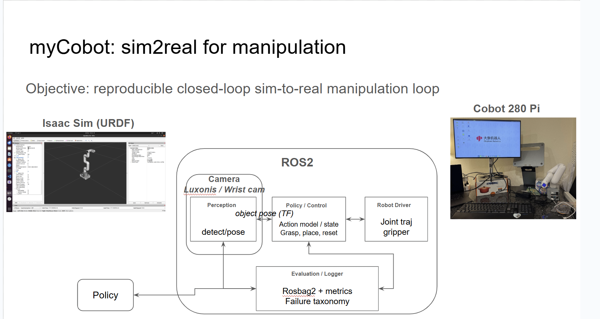
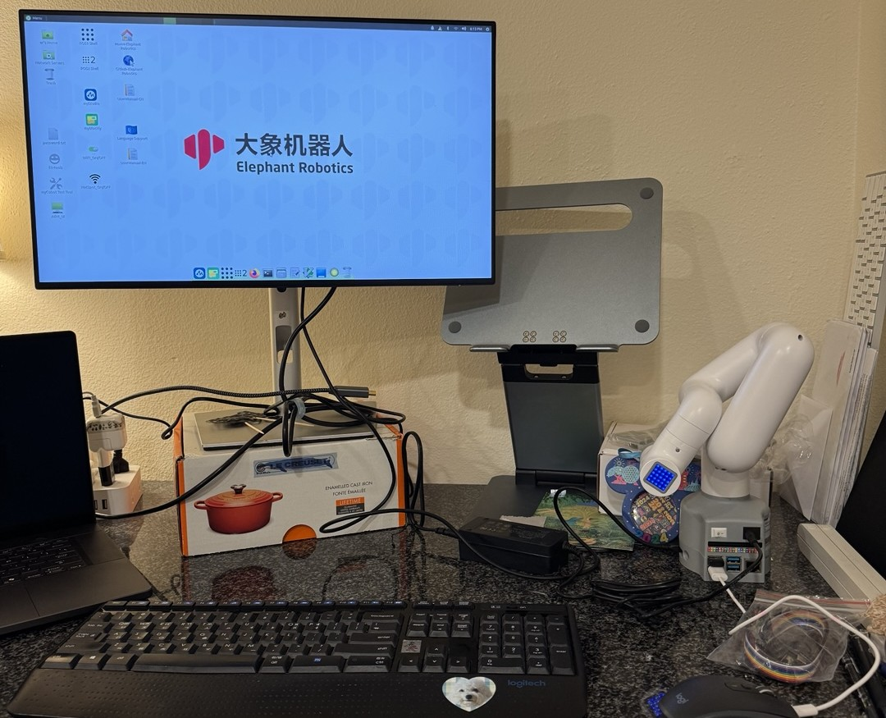

# mycobot-sim2real
Sim-to-real pick-and-place for myCobot 280 Pi (Isaac Sim + ROS2) · CLIP-based vision-language-action (VLA)-style policy

## Motivation

This project explores how structured robotics pipelines (ROS2, simulation,
logging, calibration) interface with modern learned policies
(vision–language–action models).

The goal is a reproducible experimental loop for:
- sim-to-real transfer
- perception–action latency analysis
- policy debugging via rich telemetry
- potential demo of simple VLA models

## Overview

## Hardware setup

